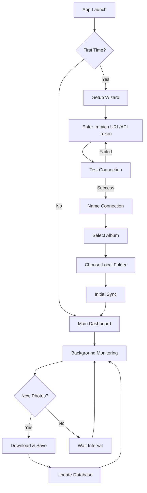

## 1. Product Overview
An Electron desktop application that connects to Immich photo management instances and automatically syncs selected albums to local storage. The app provides a minimal interface for setup and runs in the background to keep local copies updated with new photos from the Immich album.

This solves the problem of having offline access to Immich albums and creating local backups of important photo collections. Users can select specific albums to sync and choose where to store them locally.

## 2. Core Features

### 2.1 User Roles
| Role | Registration Method | Core Permissions |
|------|---------------------|------------------|
| Standard User | App installation | Connect to Immich instances, select albums for sync, manage local storage |

### 2.2 Feature Module
The Immich Album Sync app consists of the following main pages:
1. **Setup Wizard**: Immich connection configuration, album selection, local storage setup
2. **Main Dashboard**: Connection status, sync progress, album management
3. **Settings**: Connection management, sync preferences, storage location

### 2.3 Page Details
| Page Name | Module Name | Feature description |
|-----------|-------------|---------------------|
| Setup Wizard | Connection Setup | Input Immich server URL and API token, test connection validity |
| Setup Wizard | Connection Naming | Allow user to name the Immich connection for identification |
| Setup Wizard | Album Selection | Display available albums from connected Immich instance, allow user to select one for syncing |
| Setup Wizard | Local Storage Setup | Let user choose local folder path where photos will be saved |
| Main Dashboard | Connection Status | Show current connection state to Immich instance |
| Main Dashboard | Sync Progress | Display current sync status, number of photos synced/total |
| Main Dashboard | Album Management | Show selected album name, allow changing album or local storage location |
| Settings | Connection Management | Edit Immich URL/token, test connection, delete connection |
| Settings | Sync Preferences | Set sync interval, enable/disable auto-sync, manual sync trigger |
| Settings | Storage Settings | Change local storage location, view disk usage |

## 3. Core Process
**Initial Setup Flow:**
1. User opens app for the first time
2. Setup wizard guides through Immich connection (URL + API token)
3. App validates connection and fetches available albums
4. User selects an album to sync
5. User chooses local storage folder
6. App performs initial sync of existing photos
7. App runs in background monitoring for new photos

**Regular Operation Flow:**
1. App starts and connects to configured Immich instance
2. Checks selected album for new photos not in local database
3. Downloads new photos to local folder
4. Updates local database with new photo metadata
5. Continues monitoring at set intervals

## 4. User Interface Design

### 4.1 Design Style
- **Primary Color**: #2563eb (blue) for primary actions and highlights
- **Secondary Color**: #6b7280 (gray) for secondary elements
- **Button Style**: Rounded corners (8px radius), minimal borders
- **Font**: System native fonts (SF Pro on macOS, Segoe UI on Windows)
- **Layout**: Card-based with clear sections, minimal visual noise
- **Icons**: Simple line icons, consistent 24px size

### 4.2 Page Design Overview
| Page Name | Module Name | UI Elements |
|-----------|-------------|-------------|
| Setup Wizard | Connection Setup | Clean input fields for URL and token, prominent "Test Connection" button, clear status feedback |
| Setup Wizard | Album Selection | Scrollable list of albums with thumbnails, radio button selection, "Continue" button |
| Main Dashboard | Status Display | Large connection status indicator, sync progress bar, photo count statistics |
| Settings | Connection Settings | Form fields with save/cancel buttons, connection test button, delete option with confirmation |

### 4.3 Responsiveness
Desktop-first design with fixed window size (800x600px) optimized for both Windows and macOS. Interface elements scale appropriately for different screen DPI settings.

### 4.4 System Tray Integration
The app minimizes to system tray on both platforms:
- **Windows**: System tray icon with right-click menu
- **macOS**: Menu bar icon with dropdown menu
- Both show sync status and allow quick access to main window