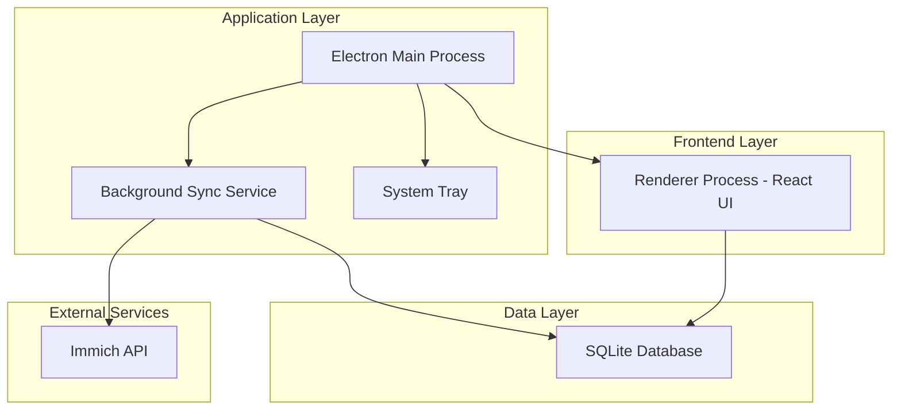
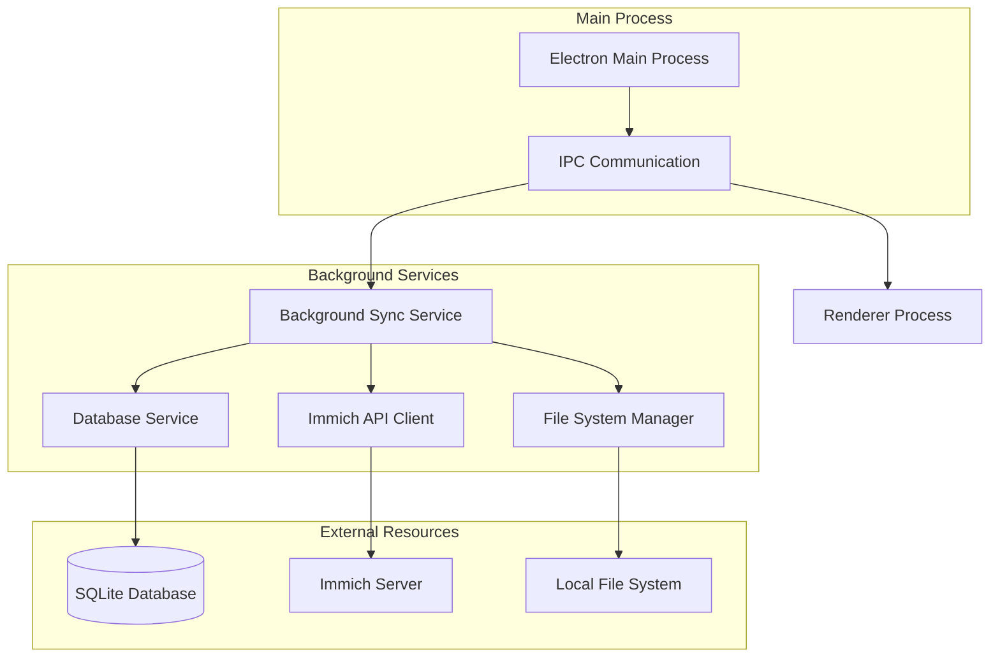
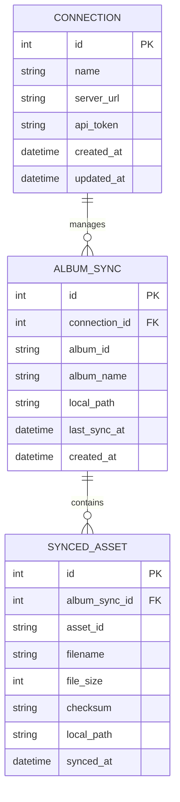

## 1. Architecture Design



## 2. Technology Description

- **Frontend**: React@18 + Electron@27 + TypeScript
- **Database**: SQLite3 with better-sqlite3 driver
- **Build Tool**: electron-vite
- **State Management**: React Context + useReducer
- **HTTP Client**: axios for Immich API calls
- **File System**: Node.js fs with proper error handling
- **Background Tasks**: node-cron for scheduled sync

## 3. Route Definitions

| Route | Purpose |
|-------|---------|
| /setup | Initial setup wizard for Immich connection |
| /dashboard | Main dashboard showing sync status and controls |
| /settings | Configuration management and preferences |

## 4. API Definitions

### 4.1 Immich API Integration

**Authentication Check**
```
GET /api/server-info
Headers: x-api-key: {api_token}
```

**Get Albums**
```
GET /api/albums
Headers: x-api-key: {api_token}
```

**Get Album Assets**
```
GET /api/albums/{album_id}/assets
Headers: x-api-key: {api_token}
```

**Download Asset**
```
GET /api/assets/{asset_id}/original
Headers: x-api-key: {api_token}
```

### 4.2 Local Database Schema

**Connection Table**
```sql
CREATE TABLE connections (
    id INTEGER PRIMARY KEY AUTOINCREMENT,
    name TEXT NOT NULL,
    server_url TEXT NOT NULL,
    api_token TEXT NOT NULL,
    created_at DATETIME DEFAULT CURRENT_TIMESTAMP,
    updated_at DATETIME DEFAULT CURRENT_TIMESTAMP
);
```

**Album Sync Table**
```sql
CREATE TABLE album_syncs (
    id INTEGER PRIMARY KEY AUTOINCREMENT,
    connection_id INTEGER NOT NULL,
    album_id TEXT NOT NULL,
    album_name TEXT NOT NULL,
    local_path TEXT NOT NULL,
    last_sync_at DATETIME,
    created_at DATETIME DEFAULT CURRENT_TIMESTAMP,
    FOREIGN KEY (connection_id) REFERENCES connections(id)
);
```

**Synced Assets Table**
```sql
CREATE TABLE synced_assets (
    id INTEGER PRIMARY KEY AUTOINCREMENT,
    album_sync_id INTEGER NOT NULL,
    asset_id TEXT NOT NULL,
    filename TEXT NOT NULL,
    file_size INTEGER,
    checksum TEXT,
    local_path TEXT NOT NULL,
    synced_at DATETIME DEFAULT CURRENT_TIMESTAMP,
    FOREIGN KEY (album_sync_id) REFERENCES album_syncs(id)
);
```

## 5. Server Architecture Diagram



## 6. Data Model

### 6.1 Data Model Definition



### 6.2 Data Definition Language

**Connections Table**
```sql
-- create table
CREATE TABLE connections (
    id INTEGER PRIMARY KEY AUTOINCREMENT,
    name TEXT NOT NULL,
    server_url TEXT NOT NULL,
    api_token TEXT NOT NULL,
    created_at DATETIME DEFAULT CURRENT_TIMESTAMP,
    updated_at DATETIME DEFAULT CURRENT_TIMESTAMP
);

-- create index
CREATE INDEX idx_connections_name ON connections(name);
```

**Album Syncs Table**
```sql
-- create table
CREATE TABLE album_syncs (
    id INTEGER PRIMARY KEY AUTOINCREMENT,
    connection_id INTEGER NOT NULL,
    album_id TEXT NOT NULL,
    album_name TEXT NOT NULL,
    local_path TEXT NOT NULL,
    last_sync_at DATETIME,
    created_at DATETIME DEFAULT CURRENT_TIMESTAMP,
    FOREIGN KEY (connection_id) REFERENCES connections(id)
);

-- create index
CREATE INDEX idx_album_syncs_connection ON album_syncs(connection_id);
CREATE INDEX idx_album_syncs_album_id ON album_syncs(album_id);
```

**Synced Assets Table**
```sql
-- create table
CREATE TABLE synced_assets (
    id INTEGER PRIMARY KEY AUTOINCREMENT,
    album_sync_id INTEGER NOT NULL,
    asset_id TEXT NOT NULL,
    filename TEXT NOT NULL,
    file_size INTEGER,
    checksum TEXT,
    local_path TEXT NOT NULL,
    synced_at DATETIME DEFAULT CURRENT_TIMESTAMP,
    FOREIGN KEY (album_sync_id) REFERENCES album_syncs(id)
);

-- create index
CREATE INDEX idx_synced_assets_album_sync ON synced_assets(album_sync_id);
CREATE INDEX idx_synced_assets_asset_id ON synced_assets(asset_id);
CREATE INDEX idx_synced_assets_filename ON synced_assets(filename);
```